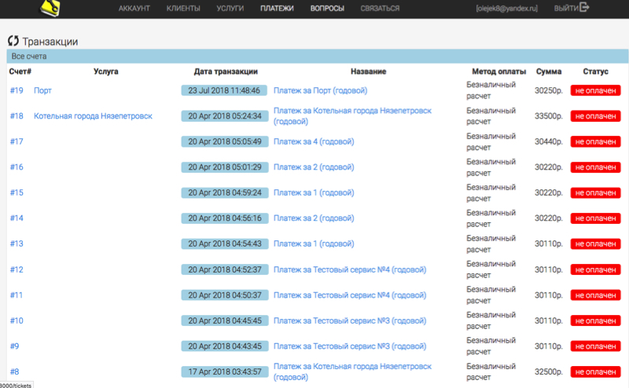
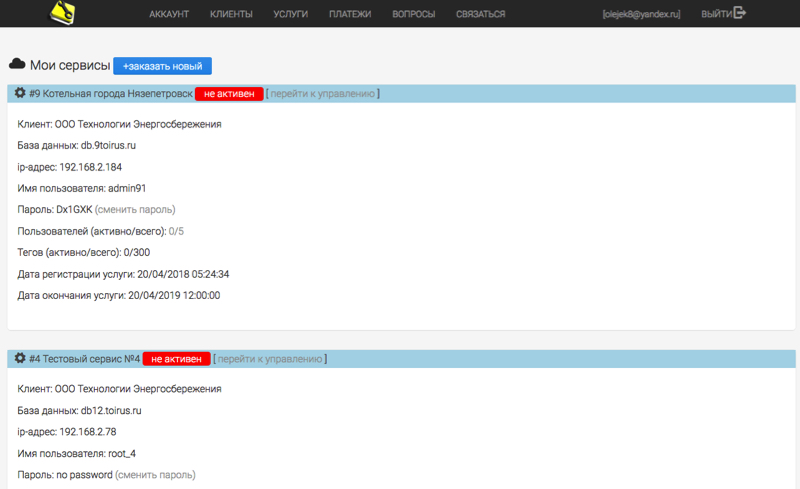
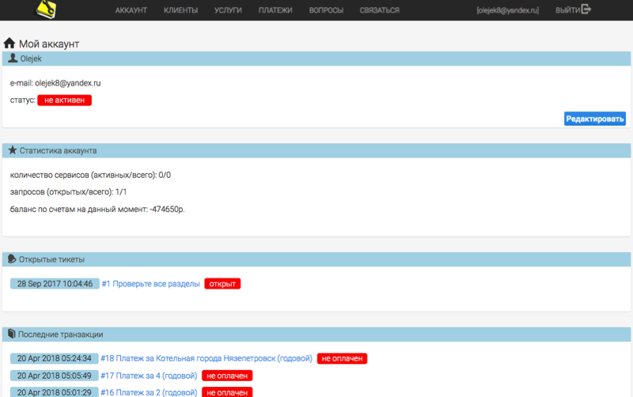

# toirus-cp
Панель управления сервисом Тоирус (toirus control panel) (<a href="http://toirus.ru">Сайт Тоирус</a>). 
Панель управления используется для добавления новых клиентов, заказа услуг, запуска формирования новых экземпляров сервисов итд.
Проект создан в Netbeans 8.2 (https://netbeans.org/)
<h2>Установка</h2>
1. Клонируем репозиторий git clone https://github.com/Olejek88/toirus-cp 
2. После установки требуется обновить зависимости и пакеты командой npm install 
3. Установить базу данных mongoDB (https://www.mongodb.com/)
4. Создать или обновить .env файл с заданием параметров: 
COOKIE_SECRET - ключ для кодирования запросов к серверу 
API_SERVER - сервер API 
API_SERVER_KEY - ключ сервера API 
5. Настроить параметры хоста (port, host) в файле toirus.js 
6. Настроить адрес базы MongoDB (mongo) 
7. Для запуска из сонсоли требуется запустить node toirus.js 
  
Визуально интерфейс выглядит следующим образом: 

  

  

